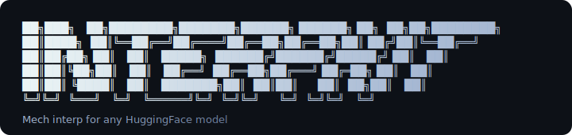

<p align="center">
  
</p>

[](https://pypi.org/project/interpkit/)
[](https://opensource.org/licenses/MIT)
[](https://www.python.org/downloads/)

---

## Why InterpKit?

Mechanistic interpretability tooling today is fragmented. Each library supports a narrow set of architectures, and moving to a different model family usually means rewriting hook code from scratch.

InterpKit provides a single, consistent interface for mech interp operations across any HuggingFace model — transformers, SSMs, vision models, and more — with zero annotation required.

---

## Install

```bash
pip install interpkit

# For linear probe support:
pip install interpkit[probe]
```

Or install from source for development:

```bash
git clone https://github.com/z4nix/interpkit.git
cd interpkit
pip install -e ".[dev]"
```

---

## Quickstart

```python
import interpkit

model = interpkit.load("gpt2")

# One-command model overview — runs DLA, logit lens, attention, attribution
# and surfaces the most interesting findings automatically
model.scan("The capital of France is")

# Or run individual operations:
model.inspect()                                        # module tree
model.dla("The capital of France is")                  # direct logit attribution
model.trace("...Paris...", "...Rome...", top_k=20)     # causal tracing
model.lens("The capital of France is")                 # logit lens (all positions)
model.attribute("The capital of France is")            # gradient saliency
model.decompose("The capital of France is")            # residual stream decomposition
```

Works the same on any HF architecture:

```python
model = interpkit.load("state-spaces/mamba-370m")
model = interpkit.load("google/vit-base-patch16-224")
model = interpkit.load("bert-base-uncased")
```

### Chat models

Instruction-tuned models work too — interpkit applies the tokenizer's chat template automatically.

```python
chat = interpkit.load("HuggingFaceTB/SmolLM2-360M-Instruct")

result = chat.chat("Write a haiku about cats.", max_new_tokens=64)
print(result["response"])

# Run any other op on the templated prompt
chat.dla(result["prompt"])

# Or pass a message list directly to any op
chat.dla([{"role": "user", "content": "Capital of France?"}])
```

See [examples/10_chat_models.ipynb](examples/10_chat_models.ipynb) for a full walkthrough including chat-style steering.

---

## Operations

| Operation | What it does | Works on |
|-----------|-------------|----------|
| **`scan`** | One-command model overview: runs DLA, lens, attention, attribution and surfaces key findings | LMs |
| **`chat`** | Send a message through the tokenizer's chat template and generate a reply | Chat / instruct LMs |
| **`dla`** | Direct Logit Attribution — decompose output logits by head and MLP contribution; optionally decompose through an SAE into per-feature attributions | LMs |
| `inspect` | Module tree with types, param counts, shapes | Any model |
| `patch` | Activation patching at a module, head, or position | Any model |
| `trace` | Causal tracing — module-level or position-aware (Meng et al.) heatmap | Any model |
| `attribute` | Gradient saliency over inputs (returns scores programmatically) | Any model |
| `lens` | Logit lens — project activations to vocabulary at all positions | LMs (auto-detected) |
| `activations` | Extract raw activation tensors at any module | Any model |
| `head_activations` | Decompose attention output into per-head contributions | Transformers |
| `ablate` | Zero/mean ablate a component and measure effect | Any model |
| `attention` | Visualize attention patterns per layer/head | Transformers |
| `steer` | Extract and apply steering vectors | LMs |
| `probe` | Linear probe on activations | Any model |
| `diff` | Compare activations between two models | Any model |
| `features` | SAE feature decomposition | Any model |
| **`decompose`** | Residual stream decomposition — per-component norms | Transformers |
| **`ov_scores`** | OV circuit analysis — W_OV matrix per head | Transformers |
| **`qk_scores`** | QK circuit analysis — W_QK matrix per head | Transformers |
| **`composition`** | Q/K/V composition scores between heads in two layers | Transformers |
| **`find_circuit`** | Automated circuit discovery via iterative ablation | Transformers |
| **`batch`** | Run any operation over a dataset with result aggregation | Any model |

---

## Scan — One-Command Model Overview

The fastest way to understand what a model is doing on an input. Runs DLA, logit lens, attention analysis, and gradient attribution, then surfaces the most interesting findings in a ranked summary:

```python
model.scan("The capital of France is")
# Output:
#   Predictions: "the" (8.5%), "now" (4.8%), "a" (4.6%)
#   Key Findings (ranked by significance):
#     1. Top contributor to "the": L11.attn (+204.701)
#     2. Top attention head: L11.H0 (+149.850)
#     3. Most salient input token: "is" (score 12.435)
#     4. Answer "the" first appears at layer 9/12

model.scan("The capital of France is", save="scan")  # exports scan_dla.png, scan_lens.png, etc.
```

## Direct Logit Attribution (DLA)

Answers the fundamental question: *why does the model predict this token?* Decomposes the output logit by component (attention block + MLP per layer) and by individual attention head:

```python
result = model.dla("The capital of France is")
# result["contributions"]      — per-component logit contributions, sorted
# result["head_contributions"] — per-head breakdown
# result["target_token"]       — the token being attributed

# Attribute a specific token
model.dla("The capital of France is", token="Paris")

# Save a bar chart
model.dla("The capital of France is", save="dla.png")

# Feature-level DLA — decompose a component through an SAE
# to see which individual features drive the prediction
model.dla(
    "The capital of France is",
    sae="jbloom/GPT2-Small-SAEs-Reformatted",
    sae_at="transformer.h.11.attn",
)
# result["feature_contributions"]["features"]
#   — per-feature logit attributions at the specified component
```

## Causal Tracing

```python
# Module-level tracing (default) — rank modules by causal effect
model.trace("...Paris...", "...Rome...", top_k=20)

# Position-aware tracing (Meng et al. 2022) — (layer x position) heatmap
model.trace("...Paris...", "...Rome...", mode="position", save="trace.png")
```

## Logit Lens

Now analyses all token positions by default, producing the classic (layers x positions) heatmap:

```python
model.lens("The capital of France is")                      # all positions
model.lens("The capital of France is", position=-1)         # last position only
model.lens("The capital of France is", save="lens.png")     # 2D heatmap export
```

## Attribution

Returns scores programmatically (no longer just prints):

```python
result = model.attribute("The capital of France is")
result["tokens"]   # ["The", "capital", "of", "France", "is"]
result["scores"]   # [8.88, 11.15, 7.24, 7.37, 12.43]
result["target"]   # 262
```

## Activation Patching

Supports module-level, head-level, and position-level patching:

```python
# Module-level (original)
model.patch(clean, corrupted, at="transformer.h.8.mlp")

# Head-level — patch only attention head 3
model.patch(clean, corrupted, at="transformer.h.8", head=3)

# Position-level — patch only positions 3 and 4
model.patch(clean, corrupted, at="transformer.h.8", positions=[3, 4])

# Combined — patch head 3 at positions 3 and 4
model.patch(clean, corrupted, at="transformer.h.8", head=3, positions=[3, 4])
```

## Head-Level Activations

Decompose an attention module's output into per-head contributions, optionally projected through W_O into residual-stream space:

```python
result = model.head_activations("The capital of France is", at="transformer.h.8")
result["head_acts"]   # tensor (num_heads, batch, seq, d_model)
result["num_heads"]   # 12
result["head_dim"]    # 64
```

## Activations, Ablation, Attention

```python
# Extract raw activations
act = model.activations("The capital of France is", at="transformer.h.8.mlp")
acts = model.activations("...", at=["transformer.h.0", "transformer.h.8.mlp"])

# Ablation — zero or mean
result = model.ablate("The capital of France is", at="transformer.h.8.mlp")
result = model.ablate("...", at="transformer.h.8.mlp", method="mean")

# Attention patterns
model.attention("The capital of France is")                   # all layers
model.attention("The capital of France is", layer=8, head=3)  # single head
```

## Residual Stream Decomposition

Break down the residual stream at any position into contributions from each attention block and MLP:

```python
result = model.decompose("The capital of France is")
# result["components"] — list of {"name": "L8.attn", "type": "attn", "norm": 8.94, ...}
# result["residual"]   — final residual stream vector
```

## OV / QK Circuit Analysis

Analyse the effective weight matrices of attention heads:

```python
# OV circuit: what does each head write to the residual stream?
model.ov_scores(layer=8)
# Per-head Frobenius norm, top singular values, approximate rank of W_OV

# QK circuit: what does each head attend to?
model.qk_scores(layer=8)

# Composition: how much does head j in layer 4 compose with head i in layer 8?
model.composition(src_layer=4, dst_layer=8, comp_type="q")  # Q-composition
model.composition(src_layer=4, dst_layer=8, comp_type="k")  # K-composition
model.composition(src_layer=4, dst_layer=8, comp_type="v")  # V-composition
```

## Circuit Discovery

Automatically find the minimal set of components that explain a behaviour:

```python
circuit = model.find_circuit(
    "The Eiffel Tower is in Paris",
    "The Eiffel Tower is in Rome",
    threshold=0.05,
)
# circuit["circuit"]       — components in the circuit, sorted by effect
# circuit["excluded"]      — components not in the circuit
# circuit["verification"]  — faithfulness check (how much output is preserved
#                            when all non-circuit components are ablated)
```

## Batch / Dataset Operations

Run any operation over a dataset of examples with automatic result aggregation:

```python
# Generic batch runner
results = model.batch("trace", [
    {"clean": "...Paris...", "corrupted": "...Rome..."},
    {"clean": "...Berlin...", "corrupted": "...Madrid..."},
], op_kwargs={"top_k": 10})
# results["summary"]["ranked_modules"] — modules ranked by mean effect across examples

# Convenience: trace over a dataset
results = model.trace_batch(dataset, clean_col="clean", corrupted_col="corrupted")

# Convenience: DLA over a list of texts
results = model.dla_batch(["The capital of France is", "The CEO of Apple is"])
# results["summary"]["ranked_components"] — components ranked by mean contribution
```

## Steering

```python
vector = model.steer_vector(" love", " hate", at="transformer.h.8")
model.steer("The weather today is", vector=vector, at="transformer.h.8", scale=2.0)
```

> Note the leading spaces. BPE tokenizers (GPT-2, Llama, ...) treat `" love"` and `"love"` as different tokens, and the leading-space variant is the one the model actually sees in normal text. interpkit prints a warning if you forget.

## Linear Probe

```python
result = model.probe(
    texts=["The cat sat", "The dog ran", "A bird flew", "A fish swam"],
    labels=[0, 0, 1, 1],
    at="transformer.h.8",
)
print(result["accuracy"])
```

## Model Diff

```python
base = interpkit.load("gpt2")
finetuned = interpkit.load("my-finetuned-gpt2")
interpkit.diff(base, finetuned, "The capital of France is")
```

## SAE Features

Decompose activations into interpretable features using pre-trained Sparse Autoencoders:

```python
# From HuggingFace
model.features(
    "The capital of France is",
    at="transformer.h.8",
    sae="jbloom/GPT2-Small-SAEs-Reformatted",
)

# From a local file (.safetensors or .pt)
model.features(
    "The capital of France is",
    at="transformer.h.8",
    sae="/path/to/sae_weights.safetensors",
)
```

No SAELens dependency — weights are loaded directly via `safetensors`.

## Activation Cache

Avoid redundant forward passes when exploring the same input with multiple operations:

```python
model.cache("The capital of France is")  # one forward pass, cache all layers
model.activations("The capital of France is", at="transformer.h.8.mlp")  # instant
model.activations("The capital of France is", at="transformer.h.0.mlp")  # instant

model.clear_cache()  # free memory
```

---

## Visualizations

Pass `save="path.png"` to export a static matplotlib figure, or `html="path.html"` for an interactive visualization:

```python
model.attention("hello world", layer=0, head=0, save="attention.png")
model.trace("...Paris...", "...Rome...", save="trace.png")
model.trace("...Paris...", "...Rome...", mode="position", save="position_trace.png")
model.lens("The capital of France is", save="lens.png")
model.steer("The weather is", vector=vector, at="transformer.h.8", save="steer.png")
model.attribute("The capital of France is", save="attribution.png")
model.dla("The capital of France is", save="dla.png")
model.scan("The capital of France is", save="scan")
interpkit.diff(base, finetuned, "...", save="diff.png")

# Interactive HTML — self-contained files with hover tooltips, filters, and sliders
model.attention("hello world", html="attention.html")
model.trace("...Paris...", "...Rome...", html="trace.html")
model.attribute("The capital of France is", html="attribution.html")
```

---

## CLI

```bash
interpkit inspect gpt2
interpkit scan gpt2 "The capital of France is"
interpkit dla gpt2 "The capital of France is"
interpkit trace gpt2 --clean "...Paris..." --corrupted "...Rome..." --top-k 20
interpkit trace gpt2 --clean "...Paris..." --corrupted "...Rome..." --mode position --save trace.png
interpkit lens gpt2 "The capital of France is"
interpkit lens gpt2 "The capital of France is" --position -1
interpkit attention gpt2 "The capital of France is" --layer 8 --save attention.png
interpkit attribute gpt2 "The capital of France is"
interpkit steer gpt2 "The weather is" --positive " love" --negative " hate" --at transformer.h.8
interpkit ablate gpt2 "The capital of France is" --at transformer.h.8.mlp
interpkit decompose gpt2 "The capital of France is"
interpkit diff gpt2 my-finetuned-gpt2 "The capital of France is" --save diff.png
interpkit features gpt2 "The capital of France is" --at transformer.h.8 --sae jbloom/GPT2-Small-SAEs-Reformatted
interpkit features gpt2 "The capital of France is" --at transformer.h.8 --sae ./my_sae.safetensors
interpkit dla gpt2 "The capital of France is" --sae jbloom/GPT2-Small-SAEs-Reformatted --sae-at transformer.h.11.attn

# Chat / instruct models — applies the tokenizer's chat template automatically
interpkit chat HuggingFaceTB/SmolLM2-360M-Instruct "Write a haiku about cats." --max-new-tokens 64
interpkit chat HuggingFaceTB/SmolLM2-360M-Instruct "What is 2+2?" --system "You are terse." --show-prompt

# Interactive HTML output
interpkit attention gpt2 "hello world" --html attention.html
interpkit trace gpt2 --clean "...Paris..." --corrupted "...Rome..." --html trace.html
interpkit attribute gpt2 "The capital of France is" --html attribution.html

# Vision models — auto-preprocessed
interpkit attribute microsoft/resnet-50 cat.jpg --target 281
```

Run `interpkit` with no arguments for a full command reference, or
`interpkit --extensive` for a beginner-friendly walkthrough of every command.

If the `interpkit` console script isn't on your `PATH` (e.g. fresh
environments, sandboxed installs, or running from a checkout without
re-installing), every command also works as `python -m interpkit ...`:

```bash
python -m interpkit scan gpt2 "The capital of France is"
python -m interpkit chat HuggingFaceTB/SmolLM2-360M-Instruct "Hello!"
```

---

## TransformerLens interop

Already using TransformerLens? Pass your `HookedTransformer` directly into InterpKit — it auto-detects the model and extracts the tokenizer:

```python
from transformer_lens import HookedTransformer
import interpkit

tl_model = HookedTransformer.from_pretrained("gpt2")
model = interpkit.load(tl_model)

# All InterpKit operations work on TL models
model.scan("The capital of France is")
model.dla("The capital of France is")
model.trace("The Eiffel Tower is in Paris", "The Eiffel Tower is in Rome", top_k=20)
model.attention("The capital of France is", save="attention.png")
model.steer("The weather is", vector=vector, at="blocks.8", scale=2.0)
```

Translate between native and TL hook point names:

```python
interpkit.to_tl_name("transformer.h.8.mlp")       # -> "blocks.8.mlp"
interpkit.to_native_name("blocks.8.attn", model.arch_info)  # -> "transformer.h.8.attn"
interpkit.list_tl_hooks(tl_model)                  # -> ["blocks.0.hook_resid_pre", ...]
```

---

## Local models

```python
import torch.nn as nn
import interpkit

my_model = MyCustomModel()
interpkit.register(my_model, layers=["blocks.0", "blocks.1"], output_head="head")
model = interpkit.load(my_model, tokenizer=my_tokenizer)
model.trace(input_a, input_b, top_k=10)
```

---

## Examples

See the [`examples/`](examples/) directory for Jupyter notebooks:

| Notebook | Topics |
|----------|--------|
| `01_quickstart` | Inspect, scan, DLA, trace, lens, attribution, patching, ablation |
| `02_attention_patterns` | Per-head heatmaps, layer filtering, HTML export |
| `03_steering_vectors` | Extract and apply steering vectors at different layers/scales |
| `04_sae_features` | Sparse Autoencoder feature decomposition |
| `05_caching_and_probing` | Activation cache, linear probes across layers |
| `06_model_comparison` | Diff two models, side-by-side tracing and logit lens |
| `07_vision_models` | ResNet/ViT attribution, ablation, activations |
| `08_dla_and_circuits` | DLA, head activations, residual decomposition, OV/QK analysis, composition, circuit discovery |
| `09_scan_and_batch` | Auto-scan, batch operations, dataset workflows |
| `10_chat_models` | Chat-template handling, `model.chat()`, message-list inputs, chat-style steering |

---

## License

MIT
